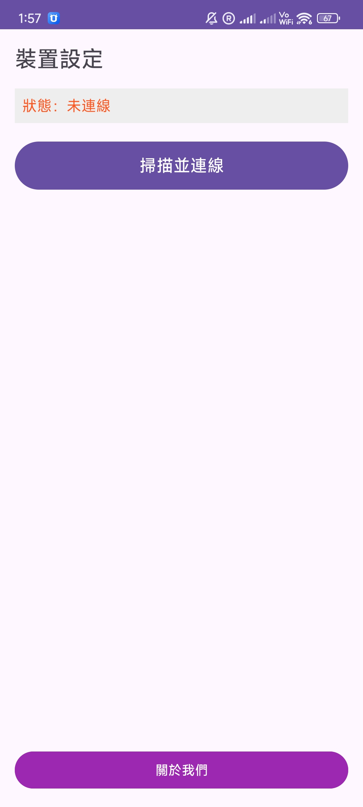
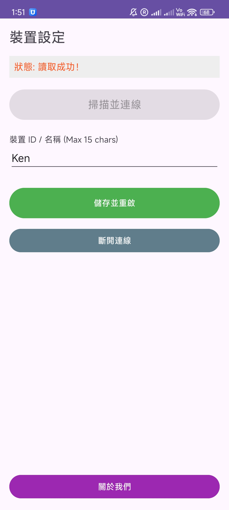

# 📱 登山緊急通訊器 - Android Companion App

> 本專案為 [**登山緊急通訊器**](https://github.com/liquidCS/LoRa-Mountain-Communication) 的手機端應用程式

## 📖 專案簡介

[**登山緊急通訊器**](https://github.com/liquidCS/LoRa-Mountain-Communication)

## ✨ 核心功能

### 📡 裝置連接與控制 (Connectivity)
* **BLE 配對**：掃描並連接 LoRa 硬體節點
* **參數設定**：透過 App 修改裝置 ID

## 🛠️ 技術架構

* **開發語言**：Java
* **最低版本需求**：Android 12.0 (API Level 31) 以上

## 📸 應用截圖 (Screenshots)
| 裝置掃描 | 參數設定頁面 |
|:---:|:---:|
|  |  |

## 🚀 安裝與使用說明

### 下載 APK
您可以前往本專案的 [**Action 頁面**](../../actions) 下載最新編譯好的 `app-debug.apk`

### 連線步驟
1.  開啟 **登山緊急通訊器** 電源
2.  開啟手機 App，授權藍牙權限
3.  進入「裝置掃描」頁面，點擊 `LoRa_Node_XXXX` 進行連線

## 📄 授權 (License)
本專案採用 MIT License - 詳見 [LICENSE](LICENSE) 文件。
